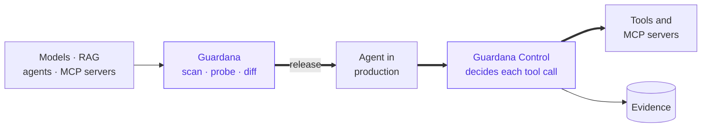

# Guardana and Guardana Control: measure before it ships, supervise while it runs

**Status:** accepted · **Written:** 2026-09-24 · **Revised:** 2026-09-25, before
publication, to follow Guardana Control's
[ADR-0024](https://github.com/guardana/control/blob/main/docs/adr/0024-control-and-guardana-are-independent.md)
and the line between supervising agents and measuring answers · **Scope:** the product
line between this repository and `guardana/control`, and the sites that present them

## The question

Guardana Control is public at
[github.com/guardana/control](https://github.com/guardana/control), in alpha. Today it is
an MCP gateway: it sits in the request path of an agent's tool calls, decides each one
(`ALLOW`, `DENY`, `REQUIRE_APPROVAL`, `ALLOW_WITH_OBLIGATIONS`, `INDETERMINATE`), enforces
the decision and records who acted, on whose behalf, under which policy version and with
what effect. Its roadmap goes further: procedures an agent is held to, a supervisor that
reads agent telemetry and reports deviations and access attempts, a graph of every run,
stopping an agent, the quality of a run's outcome, and one view over a fleet of planes.

Guardana verifies from outside any request path: it scans artifacts, probes deployed
systems, grades recorded runs, and measures and compares answers between releases.

Read side by side, the two roadmaps meet in three places: Guardana's "Next" lane planned
an intake of production traffic with continuous rules and alerting, which is what
Control's supervisor does; Control's "quality of outcomes" reports change after a model,
prompt or tool change, which is what `guardana diff` answers; and both grade the same
agent behaviour — an unapproved side effect, a credential in a tool argument. This
document draws the line so that neither product needs the other and neither takes the
other's ground.

## What each one answers

| | Guardana | Guardana Control |
|---|---|---|
| The question | Is this model, RAG pipeline or agent safe and good enough to ship, and did it get worse? | May this agent do this now, and is it doing what it should? |
| Where it runs | Outside any request path: CI, a laptop, a schedule | In the request path of tool calls, and beside the agents |
| What it reads | Artifacts, the answers to requests it sends, recordings and datasets handed to it as files | Live tool calls, its own evidence, the telemetry agents emit |
| What it produces | Findings, measurements and a gate verdict per run | A verdict per call, enforced; reports on runs; an evidence record |
| When it acts | Before release, and between releases | While agents run |

Both refuse a false green in the same words: an `unverified` result is never clean, and an
`INDETERMINATE` decision is never an allow. Both are Apache-2.0, have no telemetry, and put
the commercial line in the same place: only hosting and curated content may be paid.

## Decisions

### 1. The names stay

The verifier keeps the family name, **Guardana**; the inline product is **Guardana
Control**. No package, command or repository is renamed. Renaming the verifier would touch
every package, page and pinned workflow for a clarity gain the sites provide on their own.

### 2. The line: live agents are Control's, measured answers are Guardana's

- **Guardana Control owns everything that watches agents while they run**: intake of live
  agent traffic and telemetry, procedure conformance, deviations, access attempts,
  unfinished runs, alerting on production runs, run graphs, the inventory of agents and
  tools, stopping an agent, and the outcome quality of live runs.
- **Guardana owns everything measured before release, under conditions it controls**: the
  supply chain of models and artifacts; RAG retrieval, grounding and poisoning; answer
  quality and safety on versioned datasets, with repeated trials and calibrated judges;
  adversarial probes of models, agents and MCP servers; and the statistical comparison of
  two releases.
- **The test for a new feature is its input.** Live production traffic makes it Control's.
  Requests Guardana sends, or a file somebody hands it, make it Guardana's.

### 3. Independent, as Control's ADR-0024 states from its side

- Each product is complete on its own. Guardana's gate, tests and workflows install nothing
  from Control, and no Guardana roadmap row waits on a Control release.
- They meet only through formats each one publishes for anyone. Guardana's are its trace
  format, its saved-run and diff documents, its security contract files and its MCP pin
  file; Control's are its v1 wire contracts, its OTLP log records and its trail file.
- A bridge is optional and lives with the product that needs it. Control plans one in its
  `adapters/`: its evidence written in Guardana's trace format, and a Guardana contract
  turned into a signed Control policy. Guardana adds no Control-specific code to its
  engine, whose principle 1 already refuses a vendor in core; a trace is graded the same
  whoever wrote it.
- Golden fixtures for a bridge live with the bridge. No fixture is shared as a release
  condition of either project.

### 4. What crosses, on purpose

1. **Control's evidence, graded by Guardana after the fact.** Guardana's trace rules
   (`guardana.trace.unapproved_side_effect`, `guardana.trace.credential_passthrough`,
   `guardana.trace.policy_decision_ignored`) and its security contracts need approvals,
   delegations, policy decisions and side effects, which agent frameworks do not record
   and Control does. Once Control's optional exporter writes Guardana's trace format — an
   item on Control's roadmap, not built — `guardana analyze-trace` grades a recorded run
   from staging, an incident or an audit sample, offline.
2. **One MCP server, approved before release and held at run time.** Guardana approves a
   server's manifest (`--write-mcp-pin`) and reports drift from it in CI; Control keeps
   its own fingerprints and stops a changed tool at run time. Each keeps its own format;
   translating one into the other is a bridge's job.
3. **A policy seen from outside.** Guardana probes an agent that happens to reach its tools
   through Control, as it would probe any endpoint, and `guardana diff` shows what changed.
   Control tests its own policies with its own scenarios; Guardana does not test Control
   policies as such.
4. **A contract turned into a policy.** A Guardana security contract stays the source for
   verification and a Control `agent-policy` document the source for enforcement. The
   one-way converter is Control's optional bridge, so no invariant language is shared.

### 5. What overlaps, and who owns it

| Area | Owner | The other one |
|---|---|---|
| Blocking, holding for approval, obligations, pausing or stopping an agent | Control | never; Guardana stays out of the request path |
| Intake of live agent traffic, traces, logs and process events | Control | reads exported files only, and runs no intake service |
| Deviations from a procedure, access attempts, unfinished runs, alerts on production agents | Control | — |
| The graph of a run, the inventory of agents and tools | Control | records which AI system and deployment a run verified, and keeps no agent inventory |
| The outcome of live runs: finished, skipped or degraded; accepted or rejected by people; cost per outcome | Control | — |
| Answer quality and safety on a versioned dataset: suites, trials, judge calibration | Guardana | grows no datasets, assessors or judge calibration |
| Whether a release got worse, under equal samples and trials (`guardana diff`) | Guardana | reports how live runs changed, which is observation, not a controlled comparison |
| The attack library, adaptive attackers, probes of models, agents and MCP servers | Guardana | generates no attacks |
| Model and artifact supply chain, RAG retrieval and grounding | Guardana | — |
| Scheduled synthetic re-verification (`guardana monitor`) | Guardana | does not probe |
| Grading a recorded run for a release gate or an audit | Guardana | produces the recording |
| Verification results over time (the collector) | Guardana | — |
| Decisions and evidence over time (the control plane) | Control | — |

Where both need the same judgement at different times — a credential in a tool argument,
an unapproved side effect — each implements it for its own moment and neither imports the
other's. Guardana's trace rules never gain a streaming mode, and Control's detectors never
become a release gate over a dataset.

### 6. Two sites, one visual system, each repository owns its own

- `guardana.dev` is built and deployed from this repository: the family page, Guardana's
  pages and `guardana.dev/docs/`.
- `control.guardana.dev` is to be built and deployed from `guardana/control`, from its
  own `docs/` under its own checks; the host does not answer yet.
- The visual system — tokens, fonts, the mark — has one source, this repository,
  published at `guardana.dev/assets/brand/v1/` with a `SHA256SUMS` file, and never edited
  in place. Control's site is to vendor a pinned copy and check it against that digest;
  neither the site nor the check exists yet. Neither site loads anything from a third
  party.
- Each product page says what it is not, naming the other.

### 7. How guardana.dev presents Control

The repository is public, so the landing page names Guardana Control, links its
repository and states its status as its README states it: alpha, not to be deployed as a
security boundary. Control's own site is marked as coming soon, and `guardana.dev` links
no `control.guardana.dev` URL until that host answers; a link that fails is refused by
this repository's documentation rules. On that day the links move to the subdomain and
`llms.txt` points at `control.guardana.dev/llms.txt`.

### 8. The roadmap follows

Guardana's "Next" lane planned an OTLP intake with a queue, workers and continuous rules
over recorded traffic. Under decision 2 that is Control's supervisor, so the lane keeps
what does not watch production: continuous rules over synthetic runs with anytime-valid
alerting, grading an exported sample offline, and outputs for Guardana's own results.
[`production-intake.md`](production-intake.md) is superseded by this document.

## Rejected

**One site built from both repositories.** A build that checks out the other repository
couples the release of one product to the state of the other, and a broken page in one
blocks a deploy of both.

**`guardana.dev/control` served by a second Worker.** One domain concentrates search
signals, but a subdomain gives each repository an independent deployment with nothing to
coordinate.

**Renaming the verifier to Guardana Verify.** See decision 1.

**Live intake in Guardana.** It would put Guardana beside the request path, rebuild
Control's supervisor, and bring the queue, backpressure and workers of a system Guardana
is not.

**Shared schemas and fixtures as a release condition.** It couples two release trains in
two languages, and a change in one project could fail the other's gate.

**A single source for invariants.** A contract and a policy describe what an agent may do
for different moments; a one-way converter gives teams one place to write it without
making either project read the other's language.

## Open

- **Whether the collector and the control plane ever share a store** for teams that run
  both. Until decided, neither grows a view of the other's data.

## See also

- [`../threat-model.md`](../threat-model.md) — why Guardana is not an inline control
- [`trace-domain-model.md`](trace-domain-model.md) — the trace a bridge from Control's evidence targets
- [`security-contracts.md`](security-contracts.md) — the assertions Control's evidence makes checkable
- [`anytime-valid-monitoring.md`](anytime-valid-monitoring.md) — the alerting rule the "Next" lane keeps
- [`production-intake.md`](production-intake.md) — the intake design this document supersedes
