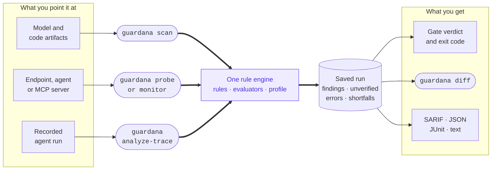

# How Guardana works — the whole product, from A to Z

Guardana checks AI artifacts, live systems, and recorded runs. This page explains the engine, its rules, its commands, and its extensions.

---

## 1. The one-sentence version

**Guardana is an open-source AI security verification tool for security and platform engineers that checks model and code artifacts, live AI systems, and recorded runs, with scans that run fully offline.** One rule engine checks the models you host or build, their files and build pipeline, and the behavior of served models. It runs on a laptop, in CI, or next to a live model.

Guardana focuses on AI/LLM risk: pickle opcodes in a `.pt` file, `trust_remote_code`, Keras `Lambda` layers, MCP tool poisoning, dataset loading scripts, system-prompt leakage, jailbreaks, excessive tool-use agency, and denial-of-wallet. Generic scanners cover risks such as SQL injection, secrets, and CVEs.

For dynamic checks, a swappable, versioned **Evaluator** grades whether an attack succeeded and reports its confidence. A result it cannot reliably grade is marked inconclusive.



---

## 2. The mental model (four ideas)

**a) One engine, five abstractions.** The engine discovers checks, runs them against a target, and grades the results. Security knowledge lives in five kinds of pluggable piece: Target, Rule, Evaluator, Finding, and Profile.

**b) Two layers: build vs runtime.**

- **Build** checks model files, weights, dependencies, source code, and training data. These static checks read artifacts without a network and run on your machine, in CI, or on a training server.
- **Runtime** checks served behavior, including prompt injection, jailbreaks, system-prompt leakage, secret-leaking output, excessive tool use, and unbounded output. These dynamic checks exercise a live endpoint and grade its replies.

`RuleMeta.surface` records the layer. `guardana rules` groups rules by it.

**c) Three ways to run it, one engine underneath.** `scan` runs build rules. `probe` runs runtime rules once. `monitor` re-runs runtime probes on a schedule next to a served model, outside its request path. They use the same rules, findings, and report format. `diff` runs no rules; it compares two saved runs to determine whether the second is worse. The command selects the layer.

**d) A finding is a finding.** YAML and Python checks of files and live models produce the same shape: severity, an OWASP/MITRE/NIST standards tag, evidence, and, for dynamic checks, a graded verdict with confidence. That supports one report format, policy gate, and collector.

---

## 3. The engine, box by box

The engine lives in `guardana-core`.

### Target — the thing under test

A Target gives rules a common interface to files or models.

- `ArtifactTarget` walks a directory and gives rules model files, manifests, and source. It skips `.git`, `.venv`, `node_modules`, and similar directories.
- `EndpointTarget` connects to a live chat endpoint. It provides `chat(messages)` and, when supported, `offer_tools(messages, tools)`. It hides the wire protocol selected by `--provider openai|ollama|tgi`.

Targets advertise `READ_FILES`, `CHAT`, `PLANT_SYSTEM_PROMPT`, and `CALL_TOOLS` capabilities. Rules declare what they need. The runner records a skip when a target lacks a required capability.

### Rule — what to look for

A Rule is one check. Declarative YAML sends prompts to an evaluator or runs a multi-turn `steps:` scenario. Python plugins handle parsing a pickle, walking an AST, reading a model config, or driving a tool-calling probe.

Each rule carries `RuleMeta`: its id, severity, `surface`, standards taxonomy, and required capabilities. The `surface` is derived automatically: artifact ⇒ build; endpoint ⇒ runtime.

### Evaluator — did it succeed, and how sure are we

An Evaluator grades a model reply into a **Verdict** with an `outcome` (pass, fail, or `inconclusive`), `confidence`, `rationale`, and evaluator id. You can change the grader without changing the rule. Shipped evaluators are:

- `keyword`: refusal-marker matching with low confidence. `guardana calibrate` measures and corrects its error, as it does for `guard` and `llm_judge`.
- `canary`: near-certain detection of a secret token planted in the system prompt.
- `length`: reply-length grading; a runaway reply to a divergence prompt is a denial-of-wallet lead.
- `amplification`: the ratio of reply size to request size, for cost asymmetry.
- `tool_call`: grades what an agent did, rather than what it said.
- `llm_judge`: an LLM judge behind a trusted endpoint, with a versioned rubric and confidence measured by agreement across samples. It is wired from config.
- `guard`: an opt-in external safety classifier, such as Llama Guard.

If an evaluator cannot grade a reply, it returns `inconclusive`, never `pass`. That includes no reply, no planted canary, or an unparseable judge answer. A final assistant turn with blank text makes `Exchange.reply_text` `None`, so graders share the same empty-reply decision.

### Finding / Report — the normalized result

Rules produce `Finding`s. A `ScanResult` keeps findings apart from `unverified` checks that ran without a verdict and `errors` for checks that never ran, such as a failed plugin import, an unloadable rule file, or a rule exception. Errors fail the gate by default. Renderers produce `human`, `json`, `sarif` for GitHub code scanning, or `junit` output.

`observations` records what the target saw: models and formats, dependency manifests, datasets, and notebooks. It supports questions about deployed components and changes between runs without walking the target again. Observations come from the target, so excluding a rule cannot remove a component from the list. They carry no compliance vocabulary. An extension package can turn them into a CycloneDX ML-BOM or audit template.

### Profile — what to run and when to fail

A `guardana.yaml` or named preset (§5) selects rules with include/exclude globs and sets `fail_on.severity`, `min_confidence`, `fail_on_inconclusive`, and `fail_on_error`. An invalid profile raises at load time, including a typo'd key, an out-of-range number, or an empty include.

### Registry + Runner — discovery and execution

- The **Registry** discovers built-in and third-party rules and evaluators through Python entry points. Private rules use the same path as built-ins.
- The **Runner** takes a registry, profile, and target. It skips rules excluded by layer, profile, or target capabilities. It catches and records rule exceptions so a failed rule cannot abort the scan or appear to pass. It sorts results into findings or `unverified` and returns a `ScanResult`.

### One scan, end to end

`guardana scan ./model-dir` builds an `ArtifactTarget`. `Registry.discover()` finds installed rules. Guardana resolves the default profile, `guardana.yaml`, or `--preset`. `Runner` runs build rules the target can support. The renderer prints the findings, and `gate()` sets a non-zero exit code when a result meets the failure bar or zero rules actually ran.

---

## 4. The two layers, made concrete

`guardana rules` groups the catalogue by layer:

- **Build-time (static, artifact)** — 19 rules cover pickle opcodes; unsafe deserialization sinks; `trust_remote_code`/`torch.hub.load`; config-`auto_map` and kernel-dispatch RCE; chat-template SSTI; ONNX graph risk; notebook payloads; Keras/TF/model-format code execution; advisory-backed malicious and hallucinated dependencies; insecure transport; hardcoded secrets; MCP tool poisoning; hidden-instruction rules-file backdoors; and training-data integrity.
- **Runtime (dynamic, endpoint and trace)** — 32 rules cover direct prompt injection, DAN-style jailbreaks, a multi-turn gradual-jailbreak scenario, indirect (RAG) injection, excessive tool-use agency, unbounded consumption (denial-of-wallet), cost asymmetry, output-secret leakage, and canary-proven system-prompt leakage. Six agentic checks cover tool-result injection, credential exfiltration through a tool argument, over-broad tool arguments, memory poisoning across a session boundary, hidden context recited from a tool schema, and a live MCP server's tool manifest. Eight checks examine whether a live MCP server authorizes a caller: whether it answers without a credential; offers an authorization surface a conforming client can use; accepts a token it could not have issued; uses a guessable session id or treats one as authentication; offers scopes that express least privilege; directs a client to an address it must not follow; lets a client detect an authorization-code mix-up attack; and restricts a tool listing marked cacheable by any client to authorized callers. Nine runtime rules grade recorded executions: a credential in a tool argument; a credential crossing two trust boundaries; a token outside its audience; a session standing in for an identity; a scope nobody consented to; a run that went ahead against a policy decision; an unapproved consequential effect; retrieval of another tenant's document; and an agent using more authority than a handoff carried to it.

`scan` selects build rules. `probe` and `monitor` select runtime rules for live systems; `analyze-trace` selects runtime rules that read a recording.

---

## 5. The three moments you run it — and presets

| Moment | Command | Preset | What it's tuned for |
|---|---|---|---|
| Dev machine / CI | `guardana scan <path>` | `--preset ci` | Fast static gate; fails on HIGH. Drops into a pipeline like a linter. |
| Training server (before a run) | `guardana scan <path>` | `--preset pre-training` | Stricter: fails on MEDIUM too, so leads like an unpinned dataset or a provenance gap block a run before it consumes bad data. |
| Next to a served model | `guardana monitor --url … --model …` | `--preset monitor` | Fails on HIGH *and* on inconclusive, so the monitor going blind (judge down, empty replies) is itself an alert. |

A preset sets policy; the command selects the layer. Use `guardana.yaml` for per-rule config, custom rule directories, or a wired judge. `--profile` and `--preset` are mutually exclusive.

---

## 6. How extensions work — the framework part

Extensions add coverage without changes to the engine.

### The entry-point contract

A pip-installed package can register rules, evaluators, or targets in `pyproject.toml`:

```toml
[project.entry-points."guardana.rules"]
mypack = "mypack:provide_rules"

[project.entry-points."guardana.evaluators"]
mypack = "mypack:provide_evaluators"
```

`provide_rules()` returns your `Rule` instances (or a list). `Registry.discover()` finds them with the built-ins. Use your own id prefix, such as `acme.*`; `guardana.*` is reserved for built-ins. Profiles can include or exclude ids by glob. Entry points also register `guardana.targets` and `guardana.taxonomies`: four groups in total, all discovered the same way. See [`architecture.md`](architecture.md#current-entry-point-groups).

### The two authoring paths

- **YAML** defines single-turn `prompts:` or multi-turn `steps:` scenarios. `guardana new-rule acme.prompt.my_check` scaffolds a rule. `--rules ./dir` runs a directory without packaging.
- **Python** handles logic YAML cannot express. Subclass `Rule`, implement `run()`, and return `Finding`s. Built-in examples include `remote_code.py`, `dataset_integrity.py`, and `agent/excessive_agency.py`; each is a short, single-purpose file.

### Custom evaluators and targets

An `Evaluator` supplies a custom grader; a `Target` supplies a new backend. Both use entry points. Rules refer to evaluators by string id, so changing a grader leaves the rule intact.

### Model formats you don't have to parse yourself

A keyword's surrounding bytes can miss distant payloads or make unrelated bytes look suspicious. `guardana.core.formats` provides `read_gguf_metadata`, `read_safetensors_header`, and `read_onnx_summary` as public API. Parsing is bounded, offline, deterministic, and fail-closed. It returns data, never a verdict; your rule supplies the judgment. See [`model-formats.md`](model-formats.md).

### Test doubles, so your rule ships with proof

Every rule needs a positive and a negative fixture: one showing it fires and one showing it stays quiet. `guardana.core.testing` provides `ScriptedTransport`, `RefusingTransport`, `ToolCallingScriptedTransport`, and other scripted model doubles for network-free dynamic tests. `build_gguf`, `build_safetensors`, and `build_onnx` build malicious static fixtures from dict literals instead of committed binaries.

### A complete, runnable example

`examples/custom_rule/` is a third-party package with two plugin rules, three YAML rules, a custom classifier, a custom target, and a custom taxonomy. It registers all four entry-point groups and needs no Guardana changes. One plugin rule inspects a GGUF model file using engine parsing, leaving only policy in the rule.

---

## 7. Central monitoring, and why the collector is separate

Every rule, evaluator, report format, and run mode works fully offline, with no required network beyond the target itself. For fleet-wide visibility, `--reporter server://…` forwards normalized findings in a versioned JSON envelope at schema version 8. The envelope includes `unverified`, so the collector cannot show a false all-clear. Self-hosted `guardana-server` provides ingest, list, trend, and an opt-in monitoring dashboard, with scoped API-key authentication and PostgreSQL persistence.

`guardana-core` never imports `guardana-server`, directly or transitively. An import-linter contract and a test enforce that boundary. The open-source engine runs on its own; the collector is a separate layer.

---

## 8. The one invariant that matters most

> **A security gate must never fail open. Silence is never spelled `pass`.**

If a check cannot run or cannot grade its result, it returns `inconclusive` or a finding, not an all-clear. Examples include an unplanted canary, an unreachable judge, blank model output, and an unparseable file. If a profile disables every rule, the zero-rule gate fails.

A linter or type-checker cannot detect a false all-clear. Evaluators fail closed, profile loading rejects invalid gates, and the runner rejects zero-rule scans. The `unverified` channel carries checks without verdicts through the report and collector. Adversarial review checks the same invariant.

---

## 9. Where to go from here

- [`architecture.md`](architecture.md) — the five abstractions in code.
- [`writing-rules.md`](writing-rules.md) — YAML and Python rules.
- [`extending.md`](extending.md) — evaluators, targets, and entry points.
- [`profiles.md`](profiles.md) — the `guardana.yaml` schema and presets.
- [`usage-scan.md`](usage-scan.md) · [`usage-probe.md`](usage-probe.md) · [`usage-monitor.md`](usage-monitor.md) — the three run modes.
- [`usage-diff.md`](usage-diff.md) — `guardana diff`, saved-run comparison, and why "worse" needs five names rather than a bigger number.
- [`../FEATURES.md`](../FEATURES.md) — maintained capabilities.
- [`../SECURITY.md`](../SECURITY.md) — the trust model and `--no-plugins`.
